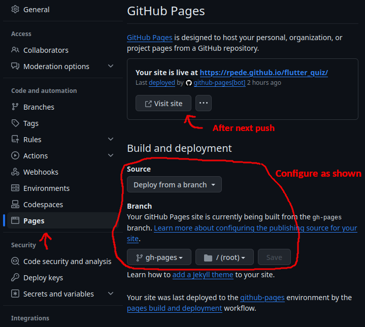
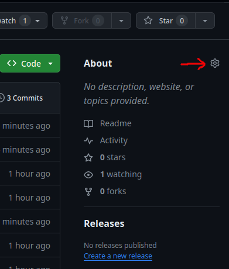
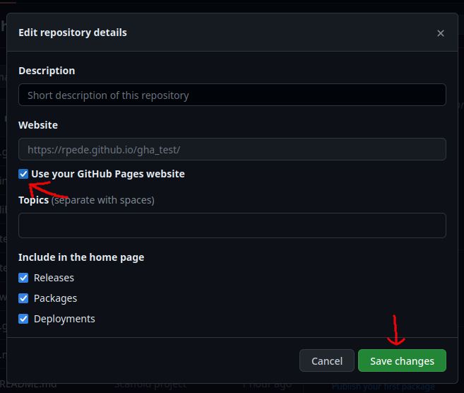

# Test & Deploy for web in Flutter

Simple way to add some helper files to your project that runs tests with
webdriver and deploys to GitHub Pages using a GitHub Action workflow.

## Requirements

Lastest version of Chrome.

## Getting started

### Install

Open a terminal (bash or zsh) in your project folder and run:

```sh
bash -c "$(curl -fsSL https://raw.githubusercontent.com/rpede/flutter_web_test_deploy/main/setup.sh)"
```

### Add test

Add your tests to `integration_test/app_test.dart`
Example:

```dart
import 'package:flutter_test/flutter_test.dart';
import 'package:integration_test/integration_test.dart';
// Replace with your app name
import 'package:my_app/main.dart';

void main() {
  IntegrationTestWidgetsFlutterBinding.ensureInitialized();
  // Change name of test to something that makes sense for your app
  testWidgets('Test MyApp', (WidgetTester tester) async {
    await tester.pumpWidget(const MyApp());

    // TODO write your test code here
  });
}
```
The only thing that is different from a widget test is that `main()` starts with:

```dart
IntegrationTestWidgetsFlutterBinding.ensureInitialized();
```

So if you have a widget test already, just copy it to `integration_test/app_test.dart`.

### Run

You can now run your integration test headless (without browser window) using:

```sh
./web_test.sh
```

Or in Chrome using:

```sh
./web_test.sh debug
```

### Deploy

- Commit and push changes to your repository
- Wait for actions to complete
- Go to "Settings" tab in your repository.
- Find "Pages" in the side menu.
- Configure as shown in screenshot below



Now add a link to your application as shown




